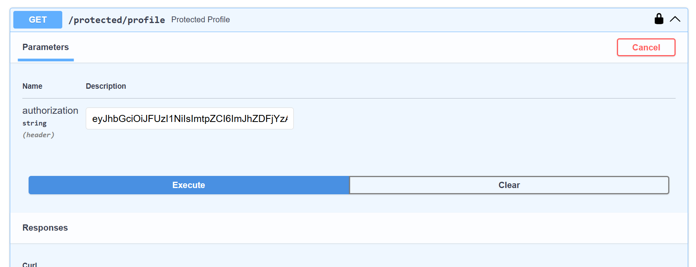

# Auth API

A secure API handling user authentication (Sign Up, Log In, Log Out) using Supabase as the Identity Provider, with protected routes verified via JWT bearer tokens.

## Setup & Run

1. Clone this repo
2. Copy `.env.example` to `.env` and fill in your own Supabase project values:
   ```
   cp .env.example .env
   ```
   ```
   SUPABASE_URL=your_project_url
   SUPABASE_KEY=your_anon_key
   PORT=8000
   ```
3. Create and activate a virtual environment:
   ```
   python -m venv venv
   source venv/Scripts/activate   # Windows Git Bash
   source venv/bin/activate       # Mac/Linux
   ```
4. Install dependencies:
   ```
   pip install fastapi uvicorn python-dotenv supabase
   ```
5. Run the server:
   ```
   uvicorn main:app --reload --port 8000
   ```
6. Visit `http://127.0.0.1:8000/docs` for interactive API docs.

## Endpoints

| Method | Path | Auth Required | Description | Success | Errors |
|--------|------|----------------|--------------|---------|--------|
| POST | `/auth/signup` | No | Create a new user account | 201 | 400 |
| POST | `/auth/login` | No | Log in, receive access + refresh tokens | 200 | 400, 401 |
| POST | `/auth/logout` | Yes | End the current session | 204 | 401 |
| GET | `/public/info` | No | Public, unauthenticated data | 200 | — |
| GET | `/protected/profile` | Yes | Get the logged-in user's profile | 200 | 401 |
| GET | `/protected/dashboard` | Yes | Second protected route, proves middleware reusability | 200 | 401 |

## Architecture

- Supabase acts as the Identity Provider — handles password hashing, account storage, and JWT issuance. This server never touches raw passwords.
- `get_current_user` is a shared FastAPI dependency: it extracts the Bearer token from the `Authorization` header, verifies it against Supabase, and returns the authenticated user. Every protected route reuses this single function via `Depends(get_current_user)`, rather than duplicating verification logic per route.
- `HTTPBearer` is used alongside `get_current_user` purely to enable Swagger's padlock icon and Authorize button — it does not perform verification itself.

## Example Request

```
curl -i http://127.0.0.1:8000/protected/profile -H "Authorization: Bearer eyJhbGc..."

HTTP/1.1 200 OK
content-type: application/json

{"message":"Access granted","user":{"id":"...","email":"test5@example.com","created_at":"..."}}
```

## Swagger UI



## Security Notes

- `.env` (containing real Supabase credentials) is gitignored; `.env.example` documents the required format without exposing real values.
- Only the Supabase **anon/publishable** key is used in this server — never the secret/service_role key, which would grant full administrative access to the project.
```

**To finish:**
1. Save your Swagger screenshot as `swagger-screenshot.png` in the project folder
2. Create `README.md` with the content above
3. Commit:
```bash
git add README.md swagger-screenshot.png
git commit -m "Stage 6: publish to GitHub and write README"
git push
```

Paste the commit confirmation and repo link — then run through the submission checklist one more time before calling this done.